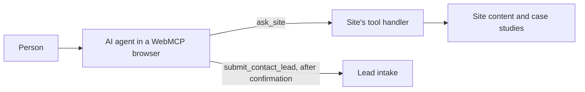
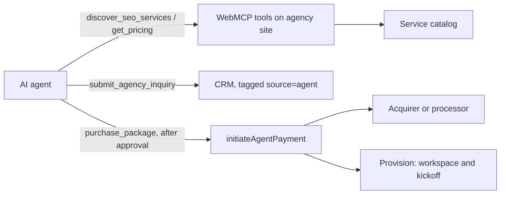
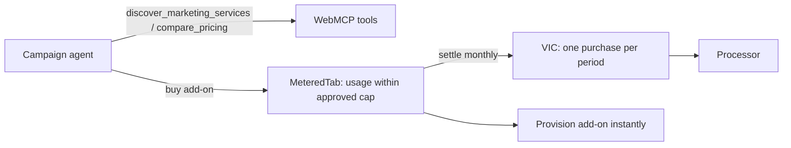

# Case studies

| Case | Type | Status |
| --- | --- | --- |
| [1. visapaymentsfrontier.io](#case-study-1-visapaymentsfrontierio) | Real, live site | Observed from public listings only; no results published |
| [2. Marketing Agency X](#case-study-2-marketing-agency-x) | **ILLUSTRATIVE** | Fictional scenario with target metrics |
| [3. SaaS Marketing Tool Y](#case-study-3-saas-marketing-tool-y) | **ILLUSTRATIVE** | Fictional scenario with target metrics |

> **ILLUSTRATIVE** means fictional: the companies don't exist, and their numbers are **targets a
> partner might plan for, not measured results.** Never present them as real outcomes.

## Case study 1: visapaymentsfrontier.io

### What it is

[visapaymentsfrontier.io](https://visapaymentsfrontier.io) is listed in the public
[WebMCP directory](https://webmcp.com/) as a live site exposing two WebMCP tools. This repo makes no claim
about who operates it.

### Tools exposed

| Tool | Type | What agents can do |
| --- | --- | --- |
| `ask_site` | Read-only | Ask about the site's services and case studies; get an answer grounded in the site's content |
| `submit_contact_lead` | Action | Submit a contact request on a person's behalf |

The tool names come from this repo's brief; the directory listing confirms two tools. Verify the names
in a WebMCP-enabled browser before citing them.

### Architecture

### Payment flow

None. It's a discovery and lead-capture site. Adding Visa Intelligent Commerce would be the next step for
anything sold at a fixed price.

### Results

**No results have been published.** Don't cite lead volumes or qualification rates for this site
unless its operator publishes them.

### Lessons for partners

1. **Two tools are enough to start.** One answers questions, one captures intent.
2. **A general Q&A tool lowers the barrier.** `ask_site` covers questions you didn't anticipate.
3. **Keep the action tool narrow.** Submitting a lead is easy to confirm and safe to retry.

### What to copy

- [webmcp-skills/marketing-discovery.json](webmcp-skills/marketing-discovery.json) for the read side
- `submit_agency_inquiry` in [examples/marketing-agency-webmcp-tools.json](examples/marketing-agency-webmcp-tools.json) for the action side

## Case study 2: Marketing Agency X

> **ILLUSTRATIVE.** Fictional agency; metrics are planning targets, not results.

### Before

- Leads come from referrals, a contact form, and paid search.
- Every inquiry needs a discovery call before pricing is shared.
- Agents researching agencies for prospects have to scrape the site, and often skip it.

### After

WebMCP tools for SEO and PPC discovery, case studies, pricing, and inquiries. Two fixed-price "starter"
packages are purchasable by agents through Visa Intelligent Commerce.

### Architecture

### Tools exposed

`discover_seo_services`, `discover_ppc_services`, `get_case_studies`, `get_pricing`,
`submit_agency_inquiry`, `purchase_package` (fixed-price packages only).

### Payment flow

Person approves → agent retrieves single-use VIC credentials → agency verifies the agent, checks the
price against its catalog, charges through its processor → service provisioned immediately.

### Target metrics (ILLUSTRATIVE)

| Metric | Target | How to measure |
| --- | --- | --- |
| Qualified leads | 3x baseline within two quarters | CRM leads tagged `source=agent` vs prior period |
| Client acquisition cost | 40% lower for agent-sourced clients | Channel cost ÷ clients won, per channel |
| Time from first contact to signed | Shorter for fixed-price packages | Median days, agent vs other channels |

### Implementation timeline

3 weeks for discovery and inquiries; payments switched on when the processor's onboarding completed.

### Tech stack

Existing website plus a `tools.js` script (WebMCP), the existing CRM, an existing payment processor, and
the merchant functions in [examples/marketing-agency-visa-ic-integration.ts](examples/marketing-agency-visa-ic-integration.ts).

### What to copy

[examples/marketing-agency-webmcp-tools.json](examples/marketing-agency-webmcp-tools.json),
[IMPLEMENTATION-GUIDE.md](IMPLEMENTATION-GUIDE.md), and the merchant example above.

## Case study 3: SaaS Marketing Tool Y

> **ILLUSTRATIVE.** Fictional tool; metrics are planning targets, not results.

### Before

- Add-ons (extra report credits, more tracked keywords) are bought by a human in the billing page.
- Partner integrations are built one by one, with manual provisioning.

### After

The tool is agent-discoverable, and agents running a campaign can buy add-ons mid-campaign within a
monthly cap the account owner approved, using a metered tab settled once a month.

### Use case

A person's campaign agent notices tracked keywords are about to hit the plan limit. It checks
`compare_pricing`, sees a +500 keyword add-on, and buys it within the approved monthly cap. The charge
is added to the month's tab. The owner sees one itemized charge at month end.

### Architecture

### Tools exposed

`discover_marketing_services`, `compare_pricing`, `retrieve_campaign_analytics`,
`optimize_campaign` (recommendations only), plus a purchase tool for add-ons.

### Payment flow

Owner approves a recurring cap once → each add-on is recorded on the tab (refused if it would exceed the
cap) → one payment settles the tab monthly with an itemized receipt.

### Target metrics (ILLUSTRATIVE)

| Metric | Target |
| --- | --- |
| Add-on purchases started by agents | A growing share of add-on revenue |
| Time from limit reached to add-on active | Minutes instead of days |
| Disputes on agent purchases | No higher than human purchases |

### What to copy

`MeteredTab` and `AgentWallet` in [visa-ic-skills/agent-payment-setup.ts](visa-ic-skills/agent-payment-setup.ts);
[webmcp-skills/campaign_optimization.json](webmcp-skills/campaign_optimization.json),
[webmcp-skills/analytics_retrieval.json](webmcp-skills/analytics_retrieval.json), and
[webmcp-skills/pricing_comparison.json](webmcp-skills/pricing_comparison.json).
