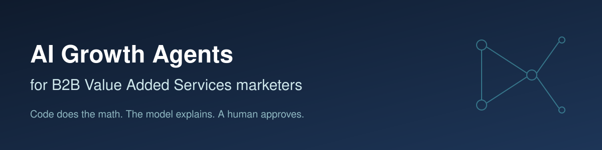

<p align="center">
  
</p>

# AI growth agents for marketers: B2B Value Added Services

[](https://github.com/trachellg1987/AI-growth-agents-for-chellebelle/actions/workflows/validate.yml)
[](LICENSE)

Ten small, tested agentic workflows for a **B2B Value Added Services (VAS) marketing team**:
client briefs, persona messaging, campaign briefs with claims approval, client-program
analysis, a Planner-Writer-Critic chain, backward planning, offer-test analysis, capacity
planning, and a pre-launch review for agent prompts.

Three rules run through every agent:

1. **Code does the math, the model explains.** Numbers are computed in plain Python and
   passed to the model in a `COMPUTED` block. The model never recomputes them.
2. **Unknowns are labeled, not guessed.** Missing facts come back as `[UNKNOWN: ...]`;
   missing proof as `[CLAIM NEEDS SUBSTANTIATION]`.
3. **A human approves anything client-facing.** Drafts are drafts until a person, and
   legal/compliance for any claim, signs off.

> **Disclaimer.** This is an independent portfolio project. It is not affiliated with,
> endorsed by, or built with any confidential information from Visa or any other company.
> All clients, products, and numbers are fictional, and every example is labeled
> ILLUSTRATIVE. Product names such as "Risk Scoring Service" are generic and fictional.

## What VAS means here

In payments, value added services are sold business-to-business: the clients are
**issuers** (banks, credit unions), **acquirers**, **merchants**, and **fintechs**, and the
buyers are roles like head of fraud/risk, head of cards, head of payments, and procurement.

For a public reference point, Visa's Form 10-K for the fiscal year ended September 30, 2025
describes its value-added services as four portfolios: **Issuing Solutions, Acceptance
Solutions, Risk and Security Solutions, and Advisory and Other Services**
([FY2025 Form 10-K on SEC EDGAR](https://www.sec.gov/Archives/edgar/data/1403161/000140316125000089/v-20250930.htm)).
The fiscal 2024 10-K used five categories (Issuing Solutions, Acceptance Solutions, Risk and
Identity Solutions, Open Banking Solutions, and Advisory Services). This repo uses those
public category names only to organize fictional examples.

## The agents

| # | Agent | What it does | Type |
| --- | --- | --- | --- |
| 01 | [Prompt basics](01-prompt-basics/) | Client meeting brief from account-manager notes | prompt |
| 02 | [Context engineering](02-context-engineering/) | Persona value propositions grounded in a context file | prompt |
| 03 | [Campaign brief](03-campaign-brief/) | Client-facing campaign brief with a compliance and claims-approval checklist | prompt |
| 04 | [Tool use with Python](04-tool-use-python/) | Live vs inactive client programs per VAS product; model sees counts, not rows | Python |
| 05 | [Multi-agent workflow](05-multi-agent-workflow/) | Planner, Writer, Critic chain; the Critic checks claims, confidentiality, and consent | Python |
| 06 | [Content repurposing](06-content-repurposing/) | One client webinar into account-manager talking points, a nurture email, and a recap | prompt |
| 07 | [Planning agent](07-planning-agent/) | Backward plan for new signed clients, with a feasibility flag | Python |
| 08 | [A/B test analyzer](08-ab-test-analyzer/) | Offer test by client segment (free pilot vs ROI assessment) | Python |
| 09 | [VAS planning agent](09-vas-planning-agent/) | Grow live client programs net of attrition; channel mix cheapest-first | Python |
| 10 | [Agents in production](10-agents-in-production/) | Static checks plus model review of an agent prompt before launch | Python |

Each folder has a `README.md`, a `prompt.md`, and an `example-output.md`. For the Python
agents, `prompt.md` is the exact prompt generated by `--dry-run`, and the computed blocks in
`example-output.md` are real output that `make test` re-checks on every run.

## Quick start

```bash
make setup                 # install the model SDKs (only needed for live runs)
make test                  # validate, unit tests, reference check, example check, smoke test
make list                  # list agents

# No API key needed:
make run AGENT=08-ab-test-analyzer ARGS="--csv 08-ab-test-analyzer/sample-ab-results.csv --stats-only"
make run AGENT=05-multi-agent-workflow ARGS="--dry-run"

# Live run: copy .env.example to .env, add a key, then load it into your shell
set -a; . ./.env; set +a
make run AGENT=08-ab-test-analyzer
```

Providers: Anthropic (`ANTHROPIC_API_KEY`, default model `claude-opus-5-5`) or OpenAI
(`OPENAI_API_KEY`, with `LLM_PROVIDER=openai`). Override models with `ANTHROPIC_MODEL` or
`OPENAI_MODEL`. See [`common/llm.py`](common/llm.py).

## How it works

```text
  CSV / arguments --> Python (skills/*/scripts) --> COMPUTED block --+
                                                                     +--> model --> draft --> human approval
  .agents/*.md context ----------------------------------------------+
```

- [`common/llm.py`](common/llm.py) holds the shared `RULES` added to every system prompt:
  use only computed numbers, label unknowns, no confidential information about any real
  company or client, no performance claims unless supplied, no competitor disparagement.
- [`skills/`](skills/) holds 13 reusable procedures. The math lives in skill scripts, once:
  A/B statistics are only in
  [`skills/ab-test-analyzer/scripts/ab_stats.py`](skills/ab-test-analyzer/scripts/ab_stats.py).
- [`.agents/`](.agents/) holds two context templates (product marketing, growth metrics) with
  `[FILL IN]` placeholders for your own facts.
- `--dry-run` prints the exact prompt and makes no network call. `--stats-only` (or
  `--static-only` for agent 10) prints only what code computed.

More detail: [docs/DESIGN-DECISIONS.md](docs/DESIGN-DECISIONS.md).

## Testing

| Command | What it checks | Calls a model? |
| --- | --- | --- |
| `make validate` | Folder structure, ILLUSTRATIVE labels, skill front matter, `[FILL IN]` placeholders, off-topic (non-B2B) terms, secrets | No |
| `make unit` | Unit tests for the statistics, planning math, summaries, and prompt checks | No |
| `make refs` | Links, script paths, and make targets in the docs exist | No |
| `make examples` | Every computed block in the docs matches a fresh run | No |
| `make smoke` | Every agent's `--help`, `--dry-run`, and `--stats-only` cases, plus clean error messages | No |
| `make test-api` | Agents 04, 05, 08 against a local fake Anthropic/OpenAI server | No (local fake) |
| `make lint` | markdownlint and Python byte-compile | No |

## Case studies

[case-studies/](case-studies/): an offer test by client segment (agent 08) and a backward
plan for live client programs (agent 09). Both are ILLUSTRATIVE.

## Repo map

```text
.agents/          context templates ([FILL IN])
01-...10-...      agents
case-studies/     worked, illustrative examples
common/           shared model helper and skill loader
docs/             design decisions
images/           banner
scripts/          validate, smoke test, example check, scaffold, API contract test
skills/           13 skills; math in skills/*/scripts
tests/            unit tests and reference check
```

## Contributing

See [CONTRIBUTING.md](CONTRIBUTING.md) and [SECURITY.md](SECURITY.md). Start a new agent with
`make scaffold NAME=my-agent PYTHON=1`.

## Credits

The idea of a numbered, folder-per-agent course for marketers is inspired by
[thaolst/ai-growth-agents-for-marketers](https://github.com/thaolst/ai-growth-agents-for-marketers)
(MIT License). This repo is rewritten for B2B VAS marketing.

## Author

Trachell Trice ([LinkedIn](https://www.linkedin.com/in/trachell1234/)). Released under the [MIT License](LICENSE).
