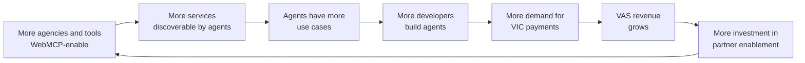

# Scaling Agentic Commerce: How WebMCP + Visa IC Drive Exponential Growth

A growth thesis for a payments network's agentic-commerce program, written from the outside using public
information only. Numbers marked **[public]** are cited. Numbers marked **[hypothesis]** are planning
assumptions to replace with internal data. Nothing here reflects non-public Visa information.

## The challenge

**Demand-side momentum is real [public].**

- Visa reports more than 100 partners working on agentic commerce, over 30 actively building in the
  Visa Intelligent Commerce (VIC) sandbox, and over 20 agents and agent enablers integrating directly.
  Partners have completed hundreds of controlled, real-world agent-initiated transactions
  ([Visa, December 2025](https://investor.visa.com/news/news-details/2025/Visa-and-Partners-Complete-Secure-AI-Transactions-Setting-the-Stage-for-Mainstream-Adoption-in-2026/default.aspx)).
- Gartner predicts one-third of interactions with generative AI services will use autonomous agents to
  complete tasks by 2028
  ([Gartner](https://www.gartner.com/en/newsroom/press-releases/2024-03-11-gartner-predicts-one-third-of-interactions-with-genai-services-will-use-action-models-and-autonomous-agents-for-task-completion-by-2028)),
  and expects AI agents to intermediate more than $15 trillion of B2B purchases by 2028
  ([Digital Commerce 360](https://www.digitalcommerce360.com/2025/11/28/gartner-ai-agents-15-trillion-in-b2b-purchases-by-2028/)).

**The supply side is the gap [hypothesis].** An agent is only as useful as the things it can find and
buy. Today most service businesses (agencies, consultancies, SaaS tools) expose nothing an agent can
reliably use: no structured tools, no agent-aware checkout. Every one of them is a missing node in the
network.

**The bottleneck is partner readiness, not demand [hypothesis].** If integrating takes a typical
partner something like 12 weeks of custom work (assumption; replace with the real median), most small
and mid-size partners never start. They don't lack interest; they lack a template.

## The lever

**A reusable, open starter kit turns integration from a project into a checklist.**

| Without a starter kit | With this repo |
| --- | --- |
| Each partner designs tool schemas from scratch | Copy [webmcp-skills/](../webmcp-skills/) and edit |
| Payment flow is researched per partner | Follow [visa-ic-skills/](../visa-ic-skills/) and the [implementation guide](../IMPLEMENTATION-GUIDE.md) |
| Onboarding needs a solutions engineer | Self-serve docs; engineers handle exceptions |
| Target: ~12 weeks [hypothesis] | Target: 2-3 weeks for a lead-capture launch [hypothesis] |

The 2-3 week target covers WebMCP discovery and lead capture. Payment acceptance also depends on
acquirer and processor onboarding, which a starter kit speeds up but doesn't remove.

**Why self-serve matters:** solutions-engineering time doesn't scale linearly with partner count. Docs
and templates do. Every partner who self-serves frees expert time for the partners who need it.

## The flywheel

1. More agencies and tools WebMCP-enable their sites.
2. More services become discoverable by agents.
3. Agents gain more real use cases (find, compare, inquire, buy).
4. More developers build agents, because there's more for agents to do.
5. More agent purchases run on Visa Intelligent Commerce.
6. Value-added services revenue grows (tokenization, authentication, risk, data services).
7. That funds more partner enablement, which brings more partners in.

Network effects only start once both sides have enough density. Partner readiness is the cheaper side
to move, because a template helps thousands of partners at once.

## GTM tactics

### 1. Developer content

A blog series, **"Building Agent-Ready Services"**, one post per week of the implementation guide:

- "Give agents a menu, not a maze: WebMCP for service businesses"
- "Your first two tools: answer questions and capture intent"
- "Taking agent payments without touching card numbers"
- "Go-live checklist: consent, claims, and human approval"

Each post ends with a link to fork this repo.

### 2. Partner enablement

Use the repo as the default onboarding asset: partner managers send it before the kickoff call, so the
first meeting starts at "here's what we built" instead of "what is WebMCP?".

### 3. Community

Feature partners who integrate: a "built with" list in the README, short partner spotlights, office
hours. Showcase working sites only, with the partner's permission.

### 4. Inbound

Developers find the repo through search and GitHub, fork it, and integrate their own service. Each fork
is a self-qualified lead for partner teams. That's growth infrastructure, not just a campaign.

## Metrics

Track one input metric per stage of the flywheel. Baselines are **[hypothesis]** until replaced with
real data.

| Metric | Baseline | Target | Why it matters |
| --- | --- | --- | --- |
| Median partner integration time | ~12 weeks [hypothesis] | 2-3 weeks [hypothesis] | Speed is the bottleneck |
| Partner activation (started → live) | ~20% [hypothesis] | 60%+ [hypothesis] | Friction removal shows up here first |
| Self-serve share of integrations | measure | rising | Scalability of enablement |
| Agent-discoverable services live | 30+ in sandbox [public] | 300+ partners [hypothesis] | Supply density for the flywheel |
| Repo forks, stars, docs visits | measure | rising | Organic developer reach |
| Agent-initiated transactions per live partner | measure | rising | Proof the supply gets used |

The 12-week, 20% and 300+ figures are illustrative planning assumptions from this repo's brief, not
Visa data. The first job of a real program would be measuring the true baselines.

## How to say this in one breath

> "Agents and payment rails are ready faster than the services agents can buy. A self-serve starter kit
> cuts partner integration from a project to a checklist, which grows the supply side of the network
> and pulls more agent payments onto Visa rails."
