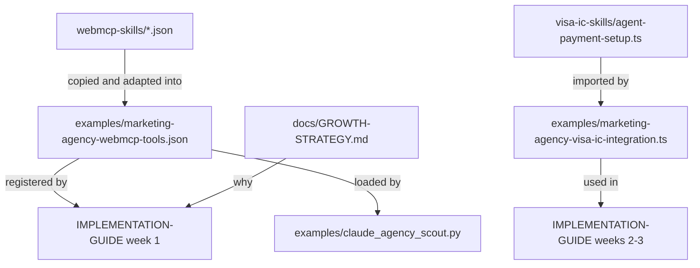

# Repo structure: where to start

This repo has two parts:

1. **Agent-ready services kit (WebMCP + Visa Intelligent Commerce):** how a marketing service becomes
   discoverable and payable by AI agents.
2. **B2B VAS marketing agent library:** ten tested agent workflows for a B2B marketing team.

## Start here

| You are | Start with | Then |
| --- | --- | --- |
| A marketer or growth lead | [GROWTH-STRATEGY.md](GROWTH-STRATEGY.md) | [CASE-STUDIES.md](../CASE-STUDIES.md) |
| A developer integrating your service | [IMPLEMENTATION-GUIDE.md](../IMPLEMENTATION-GUIDE.md) | [examples/](../examples/) |
| Learning WebMCP | [WEBMCP-EXPLAINED.md](WEBMCP-EXPLAINED.md) | [webmcp-skills/](../webmcp-skills/) |
| Learning Visa Intelligent Commerce | [VISA-INTELLIGENT-COMMERCE-EXPLAINED.md](VISA-INTELLIGENT-COMMERCE-EXPLAINED.md) | [visa-ic-skills/](../visa-ic-skills/) |
| Interested in the marketing agent library | [AGENT-LIBRARY.md](AGENT-LIBRARY.md) | [DESIGN-DECISIONS.md](DESIGN-DECISIONS.md) |

## Map

```text
README.md                         Thesis in 2 minutes, table of contents
IMPLEMENTATION-GUIDE.md           Week-by-week plan and go-live checklist
CASE-STUDIES.md                   visapaymentsfrontier.io + two ILLUSTRATIVE scenarios

docs/
  GROWTH-STRATEGY.md              Why partner readiness is the growth lever
  WEBMCP-EXPLAINED.md             WebMCP in plain English, comparison, code
  VISA-INTELLIGENT-COMMERCE-EXPLAINED.md   How agents pay safely
  README-STRUCTURE.md             This file
  AGENT-LIBRARY.md                Overview of the B2B VAS agent library
  DESIGN-DECISIONS.md             Why the agent library is built the way it is

examples/
  marketing-agency-webmcp-tools.json        Five tools for a fictional agency, annotated
  marketing-agency-visa-ic-integration.ts   Merchant-side payment acceptance (+ agent-side setup)
  chatgpt-plugin-integration.md             ChatGPT via MCP apps
  claude-agent-integration.md               Claude via MCP; walkthrough of the scout script
  claude_agency_scout.py                    Runnable Claude agent comparing three agencies

webmcp-skills/                    Reusable WebMCP tool definitions with examples
visa-ic-skills/                   VIC function templates (agent side)

01-... to 10-...                  The agent library
skills/, common/, scripts/, tests/, case-studies/, .agents/   Agent library internals
```

## How the pieces relate


