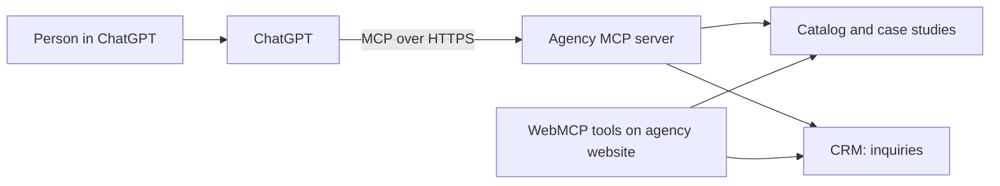

# ChatGPT integration

> **Note on the file name:** ChatGPT "plugins" were retired in April 2024. Today ChatGPT connects to
> outside tools through apps built on the **Model Context Protocol (MCP)**, with OpenAI's Apps SDK for
> interactive UI. This guide uses that current path. See OpenAI's
> [Apps SDK documentation](https://developers.openai.com/apps-sdk) for exact steps; menus change often.

Visa announced a collaboration with OpenAI on agentic payments in June 2026
([Visa press release](https://usa.visa.com/about-visa/newsroom/press-releases.releaseId.22496.html)). This
repo is independent of both companies.

## Architecture



The same tool definitions back both the website's WebMCP tools (for agents browsing the site) and the MCP
server (for ChatGPT). Check whether the browser your target agent uses supports WebMCP; the MCP server is
the dependable path for ChatGPT today.

## Step 1: set up WebMCP on your agency website

Follow week 1 of the [implementation guide](../IMPLEMENTATION-GUIDE.md): register the tools from
[marketing-agency-webmcp-tools.json](marketing-agency-webmcp-tools.json) with
`document.modelContext.registerTool`. This makes your site agent-ready for browser agents and gives you
tested handlers to reuse.

## Step 2: expose the same tools to ChatGPT

1. **Build an MCP server** that calls the same handlers. The Python example in
   [claude-agent-integration.md](claude-agent-integration.md#option-a-expose-your-tools-as-a-remote-mcp-server)
   works for ChatGPT unchanged, because both speak MCP.
2. **Deploy it over HTTPS** with authentication appropriate to your data (public catalog tools can be
   open; anything account-specific needs OAuth).
3. **Connect it in ChatGPT** as a custom app or connector (developer mode for testing, then submission
   per OpenAI's current process).
4. **Test** with the flow below.

## Example flow: "Find me an SEO agency"

1. **ChatGPT picks a tool.** It reads your tool list and chooses `discover_seo_services` (or a general
   `ask_site` tool for open questions).

2. **ChatGPT calls discovery with the person's parameters:**

   ```json
   {
     "name": "discover_seo_services",
     "arguments": { "query": "SEO for a Shopify outdoor-gear store", "monthly_budget_usd": 4000, "industry": "ecommerce" }
   }
   ```

3. **Results come back** as structured packages (prices, terms, what's included), which ChatGPT
   summarizes.

4. **The person chooses an option.** ChatGPT may call `get_case_studies` and `get_pricing` first.

5. **ChatGPT calls `submit_agency_inquiry`** after the person confirms their details and consent:

   ```json
   {
     "name": "submit_agency_inquiry",
     "arguments": {
       "contact_name": "Sam Rivera",
       "contact_email": "sam@example.com",
       "service_needed": "seo",
       "package_id": "seo-ecom-growth",
       "message": "Looking to grow organic traffic to product pages.",
       "consent_to_contact": true,
       "submitted_by_agent": "ChatGPT"
     }
   }
   ```

   Your server replies with `inquiry_id`, `status` and `next_step`.

6. **Payment, only for fixed-price packages and only with explicit approval.** There is no "auto-approve":
   the person approves the specific purchase, the agent platform retrieves single-use Visa Intelligent
   Commerce credentials, and your server charges them with `initiateAgentPayment()`
   ([marketing-agency-visa-ic-integration.ts](marketing-agency-visa-ic-integration.ts)). Anything with
   custom scope stays an inquiry.

## Checklist for ChatGPT

- [ ] Tool descriptions say what each tool does and doesn't do; ChatGPT uses them to choose
- [ ] Read-only tools are annotated as read-only; inquiry and payment tools are not
- [ ] Every tool returns readable errors (`no_match_reason`, error codes) instead of empty results
- [ ] Inquiries record `submitted_by_agent` so you can measure the channel
- [ ] No tool returns unapproved client names or claims
